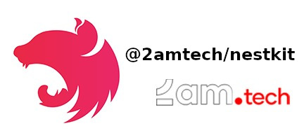

# NestKit

[](https://app.codacy.com/gh/2amigos/nest-kit?utm_source=github.com&utm_medium=referral&utm_content=2amigos/nest-kit&utm_campaign=Badge_Grade)

<p align="center">
  
</p>

Nest-kit comes from the heart of [2am.tech](https://2am.tech), a software development company with a deep passion for open source. We are committed to giving back to the community by making the tools we've developed to meet our own internal needs available to everyone.

NestKit is a monorepo project, meant to provide a comprehensive set of libraries for building projects with [nestjs](https://nestjs.com/). We hope you will find it useful!

| Package | Description | Version | Changelog |
| ------------------------------------------------------ | ------------------------------------------------------ | ------------------------------------------------------ | ------------------------------------------------------ |
| [@2amtech/crudx](./packages/crudx/README.md) | A resourceful library enhances the creation of CRUD endpoints for your application. You can find samples demonstrating its functionality and specifications in the [documentation](./packages/crudx/README.md). |  | [changelog](./packages/crudx/CHANGELOG.md) |
| [@2amtech/crudx-swagger](./packages/crudx-swagger/README.md) | This library provides an easy to use module to apply default swagger docs to auto-generated routes created with the [@2amtech/crudx-package.](./packages/crudx/README.md) |  | [changelog](./packages/crudx-swagger/CHANGELOG.md)

# Contribute

Contributions are **welcome** and will be fully **credited**. Please, refer to [contribution guidelines](CONTRIBUTING.md) for more details.

# License

[MIT License](LICENSE)

# Testing

Tests can be found with each package provided. You may execute them directly on your local machine or in a docker machine.

### Instructions:

To run tests, Docker is required, and following commands should be run:

1. Run `docker compose up`
2. Run `./test-all.sh`

To run tests for a specific package run `./test package-name`.

### On a local machine

To run the tests on a local machine, you must first set your
Mysql database credentials to `.env.testing` file. Then run
the following commands to setup the environment:

```shell
$ yarn
$ yarn nx reset
```

With the environment set, the next command will run the tests for the target project, it should be:

```shell
$ yarn nx run {proect-name}:test

# where project name is the target package, e.g:
$ yarn nx run crudx:test
```

# Demo 

Similarly to the unit tests, you may have access to demos and their tests under each package's tests folder, setting them up locally or using a provided docker-machine.

You may serve the demo app or run its unit test.

### Using the docker-machine:

```shell
# Clone this repository and access its folder;

# to serve the demo app
$ ./serve #{demo-name}
# e.g:
$ ./serve crudx-demo

# app will be running at http://localhost:3000/v1
```

### Setting it up locally:

As for testing, you must first define your Mysql credentials to the .env.testing file.
Then, follow the next commands to install the required libraries:

```shell
$ yarn
$ yarn nx reset
```

The next commands will both run the target demo app tests and serve it:

```shell
$ yarn nx run {target-project}:test # it runs the project unit tests, 

#e.g:
$ yarn nx run crudx-demo:test

$ yarn nx run {targe-project}:serve # it will serve the target demo app at http://localhost:3000/v1

#e.g
$ yarn nx run crudx-demo:serve
```

# Contributors

Thanks goes to these amazing people:

<!-- automate it when we move to github, here as a draft atm -->
<table>
  <tr>
    <td align="center"><a href="https://github.com/2amjsouza"><br /><sub><b>2amjsouza</b></sub></a></td>
    <td align="center"><a href="https://github.com/tonydspaniard"><br /><sub><b>Antonio</b></sub></a></td>
    <td align="center"><a href="https://github.com/ArekX"><br /><sub><b>ArekX</b></sub></a></td>
  </tr>
  <tr>
</table>

<blockquote>
    <a href="https://2am.tech"></a><br>
    <i>web development has never been so fun</i><br> 
    <a href="https://2am.tech">www.2am.tech</a>
</blockquote>